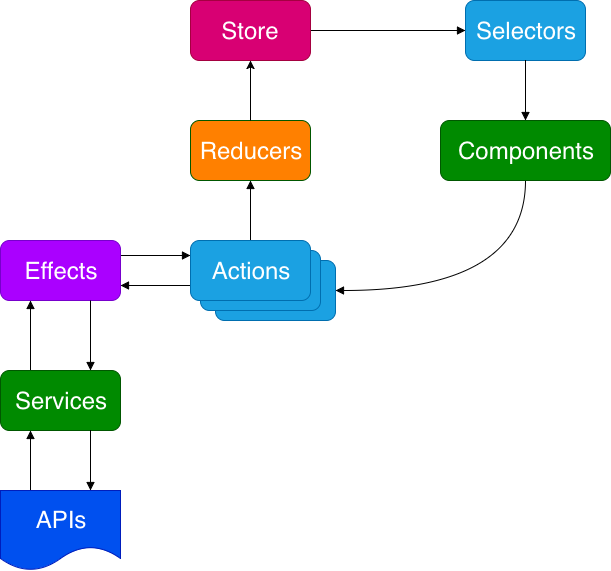

# start

Here is the initial project with no Redux. In our lab, we will be starting here and adding Redux. The image here shows the basic pattern and was copied from my article [How to Start Flying with Angular and NgRx](https://indepth.dev/how-to-start-flying-with-angular-and-ngrx/).

